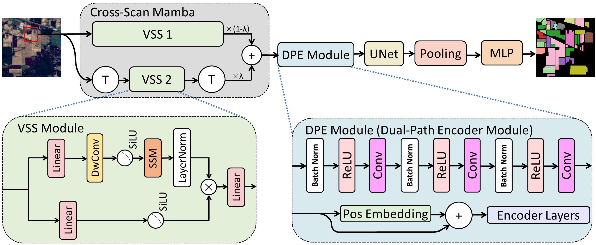

## DEMUNet:  Dual Encoder Mamba U-Net for Hyperspectral Image Classification

## Abstract:

Accurate classification and recognition of hyperspectral images (HSI) represent a crucial task in remote sensing image processing. The Transformer has emerged as a dominant method for HSI classification due to its powerful global modeling capabilities. However, the quadratic complexity associated with the self-attention mechanism poses significant challenges in terms of memory consumption and computational efficiency. Although the recently proposed Mamba model offers a potential solution to these issues, its scanning strategy struggles to effectively capture the correlations between central pixels and their surroundings, thereby limiting feature representation. To overcome these limitations, we introduce the Dual Encoder Mamba U-Net (DEMUNet), which achieves spatial-spectral long-range dependency modeling at linear complexity. Specifically, our Cross-Scan Mamba Module overcomes the unidirectional scanning restrictions of the original Mamba model, enabling multi-directional perception of image context to enhance spatial-spectral feature extraction. Additionally, our Dual-Path Encoder Module utilizes a dual-branch structure combining CNN and Transformer blocks, integrated with an adaptive feature fusion strategy to merge local details with global contextual information. Experimental results on commonly used hyperspectral datasets, including Indian Pines, Pavia University, and Houston 2013, demonstrate that DEMUNet surpasses other state-of-the-art models, achieving impressive classification accuracies of 98.56%, 99.60%, and 99.61%, respectively. 

## Requirements:

- Python 3.7
- PyTorch >= 1.12.1

## Usage:

python main.py

